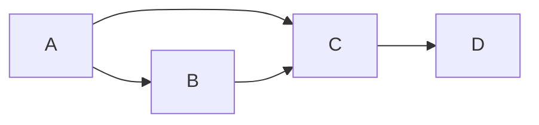
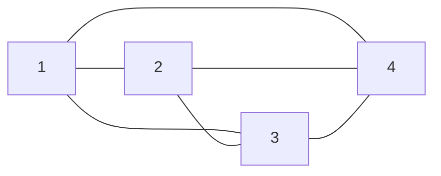
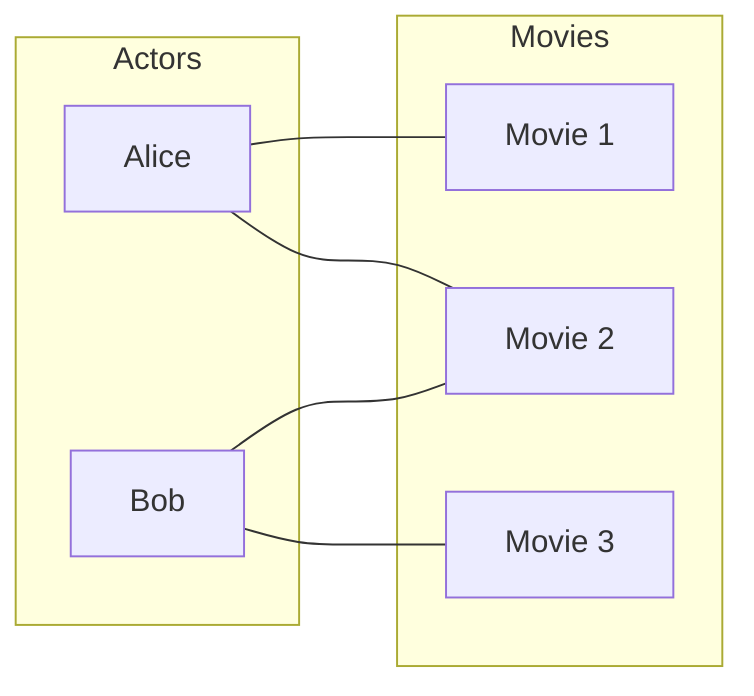
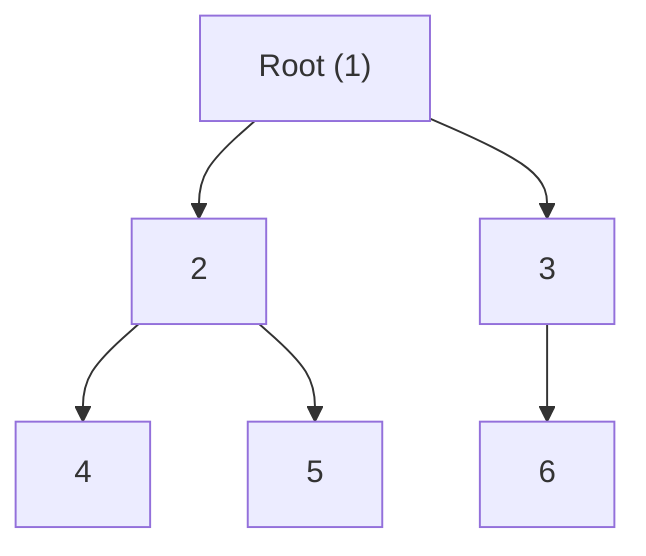
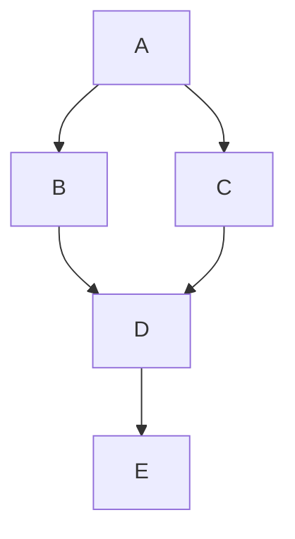
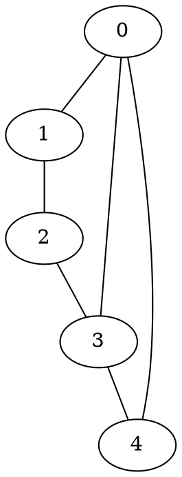
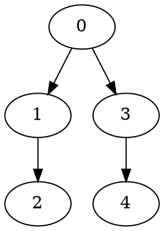
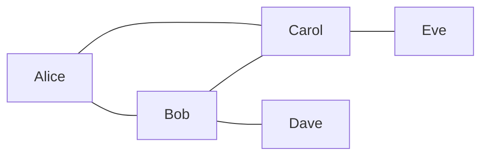
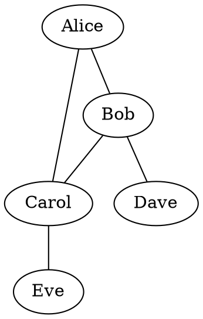

# Graph Theory Foundations

> A comprehensive reference for understanding graph theory fundamentals, written for
> researchers studying how large language models process graph-structured data.

---

## Table of Contents

1. [What Is a Graph?](#1-what-is-a-graph)
2. [Graph Representations](#2-graph-representations)
3. [Graph Types and Families](#3-graph-types-and-families)
4. [Key Properties and Metrics](#4-key-properties-and-metrics)
5. [Common Graph Problems and Algorithms](#5-common-graph-problems-and-algorithms)
6. [Graph Serialization for Text](#6-graph-serialization-for-text)

---

## 1. What Is a Graph?

### 1.1 Formal Definition

A **graph** is an ordered pair $G = (V, E)$ where:

- $V$ is a set of **vertices** (also called **nodes**)
- $E$ is a set of **edges** (also called **links** or **arcs**), each connecting two vertices

The number of vertices is typically written $n = |V|$ and the number of edges $m = |E|$.

### 1.2 Undirected vs Directed

| Property | Undirected Graph | Directed Graph (Digraph) |
|---|---|---|
| Edge notation | $\{u, v\}$ (unordered pair) | $(u, v)$ (ordered pair) |
| Symmetry | $\{u, v\} = \{v, u\}$ | $(u, v) \neq (v, u)$ in general |
| Example | Friendship networks | Web page links, citations |
| Max edges | $\binom{n}{2} = \frac{n(n-1)}{2}$ | $n(n-1)$ (or $n^2$ with self-loops) |

**Example — Undirected graph:**

```
Vertices: {A, B, C, D}
Edges:    {A-B, A-C, B-C, C-D}

    A --- B
    |   /
    |  /
    C --- D
```

**Example — Directed graph:**

```
Vertices: {A, B, C, D}
Edges:    {A→B, A→C, B→C, C→D}

    A --> B
    |   /
    v  v
    C --> D
```



### 1.3 Weighted vs Unweighted

- **Unweighted**: All edges are treated equally. $E \subseteq V \times V$.
- **Weighted**: Each edge has an associated weight $w: E \to \mathbb{R}$. For example, distances between cities, costs, capacities, or similarity scores.

**Example — Weighted graph:**

```
Vertices: {NYC, BOS, DC, PHI}
Edges (with distances in miles):
  NYC--BOS: 215
  NYC--PHI: 97
  NYC--DC:  225
  PHI--DC:  140

    NYC ---215--- BOS
     |  \
    97   225
     |     \
    PHI--140--DC
```

### 1.4 Other Variations

| Variation | Description |
|---|---|
| **Multigraph** | Allows multiple edges between the same pair of vertices |
| **Hypergraph** | Edges can connect more than two vertices |
| **Self-loops** | Edges from a vertex to itself: $(v, v)$ |
| **Signed graph** | Edges have positive or negative signs |
| **Temporal graph** | Edges exist only during certain time intervals |
| **Labeled/Attributed** | Vertices and/or edges carry labels or feature vectors |

---

## 2. Graph Representations

Every graph can be stored in multiple data structures. The choice matters for both algorithmic efficiency and for how we serialize graphs as text for LLMs.

### 2.1 Adjacency Matrix

An $n \times n$ matrix $\mathbf{A}$ where:

$$A_{ij} = \begin{cases} 1 & \text{if } (i, j) \in E \\ 0 & \text{otherwise} \end{cases}$$

For weighted graphs, $A_{ij} = w(i, j)$ if the edge exists, and $0$ or $\infty$ otherwise.

**Example** (undirected, vertices {A, B, C, D}):

```
    A  B  C  D
A [ 0  1  1  0 ]
B [ 1  0  1  0 ]
C [ 1  1  0  1 ]
D [ 0  0  1  0 ]
```

> [!NOTE]
> For undirected graphs, the adjacency matrix is **symmetric**: $A_{ij} = A_{ji}$.
> For directed graphs, it is generally **asymmetric**.

**Properties:**
- Space: $O(n^2)$
- Edge lookup: $O(1)$
- Listing all neighbors: $O(n)$
- Best for: dense graphs, matrix operations (e.g., spectral methods)
- Drawback: wasteful for sparse graphs

### 2.2 Adjacency List

Each vertex stores a list of its neighbors.

**Example** (same undirected graph):

```
A: [B, C]
B: [A, C]
C: [A, B, D]
D: [C]
```

**For the directed version:**

```
A: [B, C]
B: [C]
C: [D]
D: []
```

**Properties:**
- Space: $O(n + m)$
- Edge lookup: $O(\text{deg}(v))$
- Listing all neighbors: $O(\text{deg}(v))$
- Best for: sparse graphs, traversal algorithms
- Most common representation in practice

### 2.3 Edge List

A flat list of all edges.

**Example** (undirected):

```
(A, B)
(A, C)
(B, C)
(C, D)
```

**Weighted version:**

```
(A, B, 3)
(A, C, 5)
(B, C, 2)
(C, D, 7)
```

**Properties:**
- Space: $O(m)$
- Edge lookup: $O(m)$
- Simplest representation
- Best for: input/output, serialization, edge-centric algorithms (Kruskal's)

### 2.4 Incidence Matrix

An $n \times m$ matrix $\mathbf{B}$ where:

$$B_{ve} = \begin{cases} 1 & \text{if vertex } v \text{ is an endpoint of edge } e \\ 0 & \text{otherwise} \end{cases}$$

**Example** (edges $e_1$=A-B, $e_2$=A-C, $e_3$=B-C, $e_4$=C-D):

```
    e1 e2 e3 e4
A [  1  1  0  0 ]
B [  1  0  1  0 ]
C [  0  1  1  1 ]
D [  0  0  0  1 ]
```

> [!TIP]
> For directed graphs, use $+1$ for the tail (source) and $-1$ for the head (target) of each edge.

**Properties:**
- Space: $O(n \cdot m)$
- Rarely used in practice; useful in theoretical analysis and network flow formulations

### 2.5 Comparison Summary

| Representation | Space | Edge Lookup | Neighbor Iteration | Best For |
|---|---|---|---|---|
| Adjacency Matrix | $O(n^2)$ | $O(1)$ | $O(n)$ | Dense graphs, matrix algebra |
| Adjacency List | $O(n+m)$ | $O(\deg)$ | $O(\deg)$ | Sparse graphs, traversals |
| Edge List | $O(m)$ | $O(m)$ | $O(m)$ | I/O, simple storage |
| Incidence Matrix | $O(nm)$ | $O(n)$ | $O(m)$ | Theory, flow problems |

---

## 3. Graph Types and Families

### 3.1 Complete Graph ($K_n$)

Every pair of distinct vertices is connected by an edge.

- $|E| = \binom{n}{2}$
- $K_4$ has 4 vertices and 6 edges



### 3.2 Bipartite Graph

Vertices can be divided into two disjoint sets $U$ and $W$ such that every edge connects a vertex in $U$ to one in $W$. No edges within the same set.

**Example:** A movie-actor graph — actors in set $U$, movies in set $W$.



A **complete bipartite graph** $K_{p,q}$ has every vertex in $U$ connected to every vertex in $W$, with $|U|=p$ and $|W|=q$.

### 3.3 Trees

A tree is a connected, acyclic undirected graph. Key properties:

- Exactly $n - 1$ edges for $n$ vertices
- Unique path between any two vertices
- Removing any edge disconnects the graph
- Adding any edge creates exactly one cycle



**Rooted tree:** One vertex is designated the root; edges are implicitly directed away from it.

**Binary tree:** Each node has at most 2 children.

**Spanning tree:** A subgraph of $G$ that is a tree containing all vertices of $G$.

### 3.4 Directed Acyclic Graphs (DAGs)

A directed graph with no directed cycles. DAGs model:

- Task scheduling (prerequisite ordering)
- Version histories (git commits)
- Bayesian networks
- Computation graphs (neural network forward pass)



> [!IMPORTANT]
> DAGs always admit a **topological ordering** — a linear ordering of vertices such that for every directed edge $(u, v)$, $u$ comes before $v$.

### 3.5 Planar Graphs

A graph that can be drawn on a plane without edge crossings.

**Euler's formula** for connected planar graphs: $V - E + F = 2$ where $F$ is the number of faces (including the outer face).

**Consequence:** For a simple connected planar graph with $n \geq 3$: $m \leq 3n - 6$.

$K_5$ and $K_{3,3}$ are the classic non-planar graphs (Kuratowski's theorem).

### 3.6 Sparse vs Dense Graphs

| Category | Edge Count | Examples |
|---|---|---|
| **Sparse** | $m = O(n)$ or $m = O(n \log n)$ | Road networks, most real-world social graphs |
| **Dense** | $m = \Theta(n^2)$ | Complete graphs, dense interaction networks |

> [!TIP]
> Most real-world graphs are **sparse**. A social network with 1 billion users has ~$10^9$ nodes but ~$10^{11}$ edges — far fewer than the $\sim 10^{18}$ of a complete graph.

### 3.7 Other Important Types

| Type | Description |
|---|---|
| **Cycle graph** ($C_n$) | A single cycle on $n$ vertices |
| **Path graph** ($P_n$) | A single path on $n$ vertices |
| **Star graph** ($S_n$) | One center connected to $n-1$ leaves |
| **Regular graph** | Every vertex has the same degree |
| **Eulerian graph** | Contains a circuit visiting every edge exactly once |
| **Hamiltonian graph** | Contains a cycle visiting every vertex exactly once |
| **Chordal graph** | Every cycle of length ≥ 4 has a chord |
| **Interval graph** | Intersection graph of intervals on the real line |

---

## 4. Key Properties and Metrics

### 4.1 Degree

The **degree** of a vertex $v$, written $\deg(v)$, is the number of edges incident to it.

- **Undirected:** $\deg(v) = |\{u : \{u,v\} \in E\}|$
- **Directed:**
  - **In-degree** $\deg^-(v)$: number of edges entering $v$
  - **Out-degree** $\deg^+(v)$: number of edges leaving $v$
  - Total degree: $\deg(v) = \deg^-(v) + \deg^+(v)$

**Handshaking Lemma:** In any undirected graph:

$$\sum_{v \in V} \deg(v) = 2|E|$$

**Example** (from our earlier graph):

| Vertex | Degree |
|---|---|
| A | 2 |
| B | 2 |
| C | 3 |
| D | 1 |

**Degree distribution** $P(k)$: the fraction of vertices with degree $k$. Many real-world networks follow a **power-law** distribution $P(k) \propto k^{-\gamma}$ (scale-free networks).

### 4.2 Connectivity

- A graph is **connected** if there exists a path between every pair of vertices.
- A **connected component** is a maximal connected subgraph.
- **$k$-vertex-connected**: the graph remains connected after removing fewer than $k$ vertices.
- **$k$-edge-connected**: the graph remains connected after removing fewer than $k$ edges.

For directed graphs:
- **Strongly connected**: there is a directed path from every vertex to every other vertex.
- **Weakly connected**: the underlying undirected graph is connected.

### 4.3 Paths and Distances

- **Walk**: a sequence of vertices where consecutive vertices share an edge (vertices/edges may repeat).
- **Path**: a walk with no repeated vertices.
- **Shortest path** $d(u, v)$: the minimum number of edges (or total weight) on any path from $u$ to $v$.
- **Eccentricity** of $v$: $\varepsilon(v) = \max_{u \in V} d(v, u)$

### 4.4 Diameter and Radius

$$\text{diameter}(G) = \max_{v \in V} \varepsilon(v) = \max_{u,v \in V} d(u,v)$$

$$\text{radius}(G) = \min_{v \in V} \varepsilon(v)$$

The **center** of a graph is the set of vertices with eccentricity equal to the radius.

**Example:**

```
Path graph P5: 1 — 2 — 3 — 4 — 5

d(1,5) = 4  (the diameter)
d(3,1) = d(3,5) = 2  (vertex 3 is the center)
radius = 2
```

### 4.5 Clustering Coefficient

Measures how tightly clustered a vertex's neighbors are.

**Local clustering coefficient** for vertex $v$:

$$C(v) = \frac{2 \cdot |\text{edges among neighbors of } v|}{deg(v) \cdot (deg(v) - 1)}$$

$C(v) = 1$ if all neighbors of $v$ are connected to each other (a clique).

**Global clustering coefficient (transitivity):**

$$C = \frac{3 \times \text{number of triangles}}{\text{number of connected triples}}$$

**Example:**

```
    A --- B
    |   / |
    |  /  |
    C --- D

Neighbors of A: {B, C}
Edge between B and C? Yes.
C(A) = 2·1 / (2·1) = 1.0

Neighbors of B: {A, C, D}
Edges among them: A-C, C-D → 2 edges
C(B) = 2·2 / (3·2) = 4/6 ≈ 0.67
```

### 4.6 Centrality Measures

Centrality quantifies the "importance" of a vertex in a graph.

| Measure | Definition | Intuition |
|---|---|---|
| **Degree centrality** | $C_D(v) = \frac{\deg(v)}{n-1}$ | How many direct connections |
| **Closeness centrality** | $C_C(v) = \frac{n-1}{\sum_{u} d(v,u)}$ | How close to all other vertices |
| **Betweenness centrality** | $C_B(v) = \sum_{s \neq v \neq t} \frac{\sigma_{st}(v)}{\sigma_{st}}$ | How often $v$ lies on shortest paths |
| **Eigenvector centrality** | $\mathbf{Ax} = \lambda \mathbf{x}$ | Connected to other important vertices |
| **PageRank** | Iterative: $PR(v) = \frac{1-d}{n} + d \sum_{u \to v} \frac{PR(u)}{\deg^+(u)}$ | Random surfer importance |

Where $\sigma_{st}$ is the total number of shortest paths from $s$ to $t$, and $\sigma_{st}(v)$ is the number that pass through $v$.

**Example — Betweenness on a path graph:**

```
1 — 2 — 3 — 4 — 5

Vertex 3 has the highest betweenness centrality because
all shortest paths between {1,2} and {4,5} pass through it.
```

---

## 5. Common Graph Problems and Algorithms

### 5.1 Graph Traversal

#### Breadth-First Search (BFS)

Explores vertices layer by layer from a source vertex. Uses a **queue**.

```
BFS(G, start):
    queue ← [start]
    visited ← {start}
    while queue is not empty:
        v ← queue.dequeue()
        for each neighbor u of v:
            if u not in visited:
                visited.add(u)
                queue.enqueue(u)
```

**Time:** $O(n + m)$

**Applications:** Shortest path in unweighted graphs, connected components, level-order traversal.

**Example trace:**

```
Graph:
    1 — 2 — 4
    |       |
    3 — — — 5

BFS from vertex 1:
  Visit 1 → queue: [2, 3]
  Visit 2 → queue: [3, 4]
  Visit 3 → queue: [4, 5]
  Visit 4 → queue: [5]
  Visit 5 → queue: []
  Order: 1, 2, 3, 4, 5
```

#### Depth-First Search (DFS)

Explores as deep as possible before backtracking. Uses a **stack** (or recursion).

```
DFS(G, start):
    stack ← [start]
    visited ← {}
    while stack is not empty:
        v ← stack.pop()
        if v not in visited:
            visited.add(v)
            for each neighbor u of v:
                if u not in visited:
                    stack.push(u)
```

**Time:** $O(n + m)$

**Applications:** Cycle detection, topological sort, strongly connected components, maze solving.

**Example trace (same graph):**

```
DFS from vertex 1 (assuming neighbors processed in order):
  Visit 1 → stack: [2, 3]
  Visit 3 → stack: [2, 5]
  Visit 5 → stack: [2, 4]
  Visit 4 → stack: [2, 2]
  Visit 2 → stack: []
  Order: 1, 3, 5, 4, 2
```

### 5.2 Shortest Path Algorithms

| Algorithm | Type | Time Complexity | Handles Negative Weights? |
|---|---|---|---|
| **BFS** | Single-source, unweighted | $O(n + m)$ | N/A |
| **Dijkstra's** | Single-source, non-negative weights | $O((n + m) \log n)$ | No |
| **Bellman-Ford** | Single-source, any weights | $O(nm)$ | Yes (detects negative cycles) |
| **Floyd-Warshall** | All-pairs | $O(n^3)$ | Yes |
| **A*** | Single-source with heuristic | Varies | No |

**Dijkstra's Example:**

```
Graph (weighted):
    A --1-- B
    |       |
    4       2
    |       |
    C --3-- D

Shortest paths from A:
  A→A: 0
  A→B: 1  (direct)
  A→D: 3  (A→B→D)
  A→C: 4  (direct, or A→B→D→C = 6)
```

### 5.3 Cycle Detection

**Undirected graphs:** DFS — if you encounter a visited vertex that is not the parent of the current vertex, a cycle exists.

**Directed graphs:** DFS with three-coloring (white/gray/black). A back edge (to a gray vertex) indicates a cycle.

**Example — Cycle in directed graph:**

```
A → B → C → A   ← cycle detected!
         ↓
         D
```

### 5.4 Minimum Spanning Tree (MST)

For a connected, weighted, undirected graph, an MST is a spanning tree with minimum total edge weight.

| Algorithm | Strategy | Time Complexity |
|---|---|---|
| **Kruskal's** | Sort edges, add greedily (Union-Find) | $O(m \log m)$ |
| **Prim's** | Grow tree from a vertex (priority queue) | $O((n + m) \log n)$ |

**Kruskal's Example:**

```
Edges sorted by weight:
  B-D: 1
  A-B: 2
  C-D: 3
  A-C: 4
  B-C: 5

MST construction:
  Add B-D (1) ✓
  Add A-B (2) ✓
  Add C-D (3) ✓
  Skip A-C (4) — would create cycle
  Skip B-C (5) — would create cycle

MST total weight: 1 + 2 + 3 = 6
```

### 5.5 Graph Coloring

Assign colors to vertices so that no two adjacent vertices share the same color.

- **Chromatic number** $\chi(G)$: the minimum number of colors needed.
- $\chi(K_n) = n$
- $\chi(\text{bipartite graph}) = 2$
- $\chi(\text{planar graph}) \leq 4$ (Four Color Theorem)

**Example:**

```
    A --- B
    |   / |
    |  /  |
    C --- D

Coloring with 3 colors:
  A: Red
  B: Blue
  C: Blue
  D: Red
  
  χ(G) = 2? Let's check: A=Red, B=Blue. C is adjacent to A (Red) and B (Blue), 
  so C needs a 3rd color → Green. D is adjacent to B (Blue) and C (Green), 
  so D = Red works.
  Actually, χ(G) = 3 for this graph.
```

> [!NOTE]
> Determining $\chi(G)$ is NP-hard in general. Graph coloring appears in register allocation (compilers), scheduling, and frequency assignment.

### 5.6 Maximum Flow / Minimum Cut

Given a directed graph with edge capacities, a source $s$, and a sink $t$:

- **Max flow**: the maximum total flow from $s$ to $t$
- **Min cut**: the minimum total capacity of edges whose removal disconnects $s$ from $t$

**Max-Flow Min-Cut Theorem:** max flow = min cut.

**Algorithms:** Ford-Fulkerson ($O(mF)$ where $F$ is max flow), Edmonds-Karp ($O(nm^2)$), Push-Relabel ($O(n^2 m)$).

**Example:**

```
    s --10--> A --5--> t
    |               ↑
    +---8--> B --7--+

Capacities: s→A=10, s→B=8, A→t=5, B→t=7
Max flow = 5 + 7 = 12
Min cut = {A→t (5), B→t (7)} = 12  ✓
```

### 5.7 Graph Isomorphism

Two graphs $G_1 = (V_1, E_1)$ and $G_2 = (V_2, E_2)$ are **isomorphic** if there exists a bijection $f: V_1 \to V_2$ such that $(u, v) \in E_1 \iff (f(u), f(v)) \in E_2$.

Informally: same structure, different vertex labels.

```
Graph 1:          Graph 2:
A — B             1 — 2
|   |             |   |
D — C             4 — 3

Isomorphism: A↔1, B↔2, C↔3, D↔4
```

**Complexity:** Known to be in NP but not known to be NP-complete. Babai (2015) showed a quasipolynomial algorithm.

> [!IMPORTANT]
> Graph isomorphism is a key task in LLM graph reasoning benchmarks. LLMs must compare two textual graph descriptions and determine structural equivalence — a task that requires systematic tracking of vertex mappings.

### 5.8 Community Detection

Identifying groups of vertices that are more densely connected to each other than to the rest of the graph.

**Methods:**
- **Modularity optimization** (Louvain algorithm)
- **Spectral clustering** (using eigenvectors of the graph Laplacian)
- **Label propagation**
- **Stochastic block models**

**Modularity:**

$$Q = \frac{1}{2m} \sum_{ij} \left[ A_{ij} - \frac{k_i k_j}{2m} \right] \delta(c_i, c_j)$$

Where $k_i$ is the degree of vertex $i$, $c_i$ is the community of $i$, and $\delta$ is the Kronecker delta.

---

## 6. Graph Serialization for Text

This section is particularly relevant to LLM research — how do we write a graph as a string that a language model can process?

### 6.1 Why Serialization Matters for LLMs

LLMs receive input as a sequence of tokens. Graphs are inherently **non-sequential** structures. The choice of text serialization affects:

- Whether the LLM can reconstruct the graph mentally
- How many tokens the representation consumes
- Which graph properties are easy or hard to extract from the text
- Whether the representation introduces positional biases

### 6.2 Adjacency List Format

The most common format in LLM graph benchmarks.

```
Node 0: [1, 3, 4]
Node 1: [0, 2]
Node 2: [1, 3]
Node 3: [0, 2, 4]
Node 4: [0, 3]
```

**Pros:** Compact, groups information by node, easy to find neighbors.
**Cons:** Redundant for undirected graphs (each edge appears twice), can be long for high-degree nodes.

### 6.3 Edge List Format

```
(0, 1)
(0, 3)
(0, 4)
(1, 2)
(2, 3)
(3, 4)
```

**Pros:** No redundancy for undirected graphs (list each edge once), simple.
**Cons:** Finding all neighbors of a node requires scanning the entire list. Harder for LLMs to "look up" neighbors on demand.

### 6.4 Natural Language Description

```
There are 5 nodes in this graph: 0, 1, 2, 3, and 4.
Node 0 is connected to nodes 1, 3, and 4.
Node 1 is connected to nodes 0 and 2.
Node 2 is connected to nodes 1 and 3.
Node 3 is connected to nodes 0, 2, and 4.
Node 4 is connected to nodes 0 and 3.
```

**Pros:** Closest to natural language that LLMs are trained on, verbose but explicit.
**Cons:** Significantly more tokens. Higher token count reduces the size of graphs that fit in the context window.

### 6.5 DOT Notation (Graphviz)



For directed graphs:



**Pros:** Widely used standard, concise, supports attributes (color, weight, labels).
**Cons:** Less common in LLM training data compared to natural language.

### 6.6 Matrix Format

```
Adjacency matrix:
[[0, 1, 0, 1, 1],
 [1, 0, 1, 0, 0],
 [0, 1, 0, 1, 0],
 [1, 0, 1, 0, 1],
 [1, 0, 0, 1, 0]]
```

**Pros:** Complete information in a structured format, familiar from linear algebra.
**Cons:** Very token-heavy for large graphs ($O(n^2)$ entries), hard for LLMs to parse and reason about.

### 6.7 Parenthetical/Bracket Notation

Used in some benchmarks:

```
{0: {1, 3, 4}, 1: {0, 2}, 2: {1, 3}, 3: {0, 2, 4}, 4: {0, 3}}
```

This is essentially a Python dictionary-style adjacency list.

### 6.8 Comparison of Serialization Formats

| Format | Tokens (approx.) | Redundancy | LLM Familiarity | Neighbor Lookup |
|---|---|---|---|---|
| Adjacency List | Medium | High (undirected) | High | Easy (per node) |
| Edge List | Low | None | Medium | Hard (scan all) |
| Natural Language | High | High | Highest | Easy |
| DOT Notation | Low-Medium | None | Low-Medium | Medium |
| Matrix | Very High | None | Medium | Easy (by index) |

> [!WARNING]
> Research has shown that LLM performance on graph tasks is **sensitive to the serialization format**. The same model may succeed on a task with one format and fail with another. When designing experiments, always consider testing multiple formats.

### 6.9 Concrete Example — Same Graph, Multiple Formats

Consider this small social network:



**Edge list:**
```
Alice, Bob
Alice, Carol
Bob, Carol
Bob, Dave
Carol, Eve
```

**Adjacency list:**
```
Alice: [Bob, Carol]
Bob: [Alice, Carol, Dave]
Carol: [Alice, Bob, Eve]
Dave: [Bob]
Eve: [Carol]
```

**Natural language:**
```
In this network, Alice is friends with Bob and Carol. Bob is friends with
Alice, Carol, and Dave. Carol is friends with Alice, Bob, and Eve. Dave is
only friends with Bob. Eve is only friends with Carol.
```

**DOT:**


---

## References and Further Reading

- Diestel, R. *Graph Theory* (5th ed.), Springer, 2017.
- Cormen, T. H., et al. *Introduction to Algorithms* (CLRS), MIT Press, 2022.
- West, D. B. *Introduction to Graph Theory*, Pearson, 2001.
- Newman, M. *Networks: An Introduction*, Oxford University Press, 2010.
- Barabási, A.-L. *Network Science*, Cambridge University Press, 2016.
