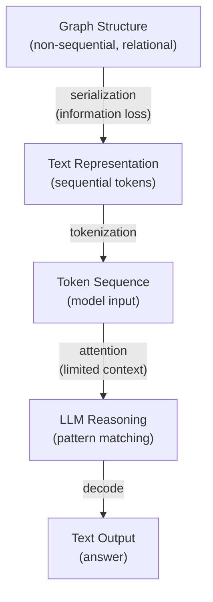
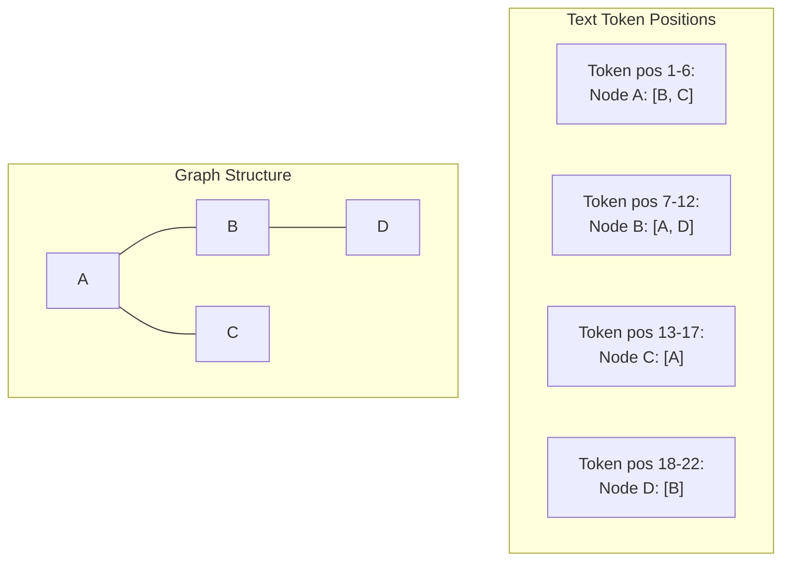
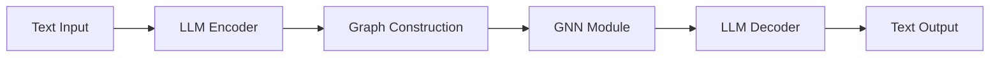
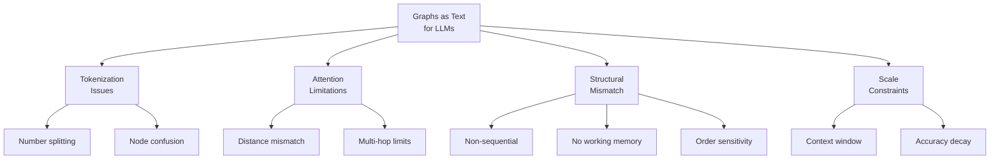

# LLMs and Graph Data

> How large language models process, represent, and reason about graph-structured
> information — and why it's fundamentally challenging.

---

## Table of Contents

1. [Overview: Graphs Meet Language Models](#1-overview-graphs-meet-language-models)
2. [Tokenization of Graph Text](#2-tokenization-of-graph-text)
3. [Attention Mechanism and Graph Structure](#3-attention-mechanism-and-graph-structure)
4. [Why Graphs Are Hard for LLMs](#4-why-graphs-are-hard-for-llms)
5. [Context Window Constraints](#5-context-window-constraints)
6. [Known Failure Modes](#6-known-failure-modes)
7. [Mitigation Strategies](#7-mitigation-strategies)

---

## 1. Overview: Graphs Meet Language Models

Large language models (LLMs) like GPT-4, Claude, Gemini, and LLaMA are trained on sequential text. They excel at tasks where the structure of the input is inherently **linear** — sentences, paragraphs, code, conversations.

Graphs, however, are fundamentally **non-linear** and **relational**. A graph $G = (V, E)$ encodes pairwise relationships that don't have a canonical sequential ordering. When we serialize a graph into text (see [graph_theory.md §6](./graph_theory.md#6-graph-serialization-for-text)), we impose an arbitrary linearization that may obscure or distort the graph's structure.

This creates a fundamental tension:



> [!IMPORTANT]
> The core research question is: **Can LLMs build and maintain an accurate internal representation of a graph from its textual description, and use that representation to answer structural queries?**

---

## 2. Tokenization of Graph Text

### 2.1 How Tokenizers Work

Modern LLMs use **subword tokenization** (BPE, WordPiece, SentencePiece). The tokenizer breaks text into tokens that may be whole words, word fragments, individual characters, or numbers.

This has important implications for graph text:

### 2.2 Number Tokenization

Node identifiers in graph descriptions are often integers. Tokenizers handle numbers inconsistently:

| Input | Possible Tokenization | Issue |
|---|---|---|
| `42` | `["42"]` or `["4", "2"]` | Single vs multi-token |
| `128` | `["128"]` or `["12", "8"]` or `["1", "28"]` | Inconsistent splits |
| `1024` | `["10", "24"]` or `["1", "024"]` | Non-semantic boundaries |
| `Node 7` | `["Node", " 7"]` | Whitespace attached |

**Why this matters:** When the LLM needs to compare node `12` with node `128`, the shared token prefix `"12"` can create spurious associations. The model must learn that `12` and `128` are completely different node identifiers, despite sharing tokenized substrings.

**Example — Token confusion:**

```
Adjacency list:
Node 1: [2, 12, 123]
Node 12: [1, 3]
Node 123: [1, 2]

If "12" in "123" is tokenized the same way as "12" in "Node 12",
the model may confuse the neighbors of Node 12 and Node 123.
```

### 2.3 Node Name Tokenization

When nodes have text labels (e.g., city names, person names), tokenization is more natural:

```
Alice: [Bob, Carol]
Bob: [Alice, Dave]
```

Each name tokenizes into a familiar word token. The LLM can leverage its pre-trained knowledge of names. However, this introduces its own bias — the LLM may inject real-world knowledge about "Alice" and "Bob" that is irrelevant to the graph structure.

### 2.4 Delimiter and Structure Tokens

Graph serializations use structural delimiters:

```
Adjacency list uses: colons, brackets, commas
Edge list uses:      parentheses, commas
DOT notation uses:   braces, arrows (--, ->), semicolons
Matrix format uses:  brackets, commas, whitespace
```

These delimiters are tokenized differently across models. A model pre-trained on lots of code may handle bracket-heavy formats better than one trained primarily on prose.

### 2.5 Token Count by Format

For a graph with $n$ nodes and $m$ edges, approximate token counts:

| Format | Token Count | Example ($n=50$, $m=150$) |
|---|---|---|
| Edge List | $\sim 4m$ | ~600 tokens |
| Adjacency List | $\sim 3n + 2m$ | ~450 tokens |
| Natural Language | $\sim 10n + 4m$ | ~1100 tokens |
| Matrix | $\sim n^2 + 2n$ | ~2600 tokens |

> [!TIP]
> Edge list format is generally the most token-efficient for sparse graphs, while adjacency list format offers a better balance between efficiency and readability for LLMs.

---

## 3. Attention Mechanism and Graph Structure

### 3.1 How Attention Works (Brief Review)

The transformer attention mechanism computes:

$$\text{Attention}(Q, K, V) = \text{softmax}\left(\frac{QK^T}{\sqrt{d_k}}\right) V$$

For a sequence of $L$ tokens, each token attends to every other token with a learned attention weight. This creates an $L \times L$ attention matrix.

### 3.2 Attention ≠ Graph Adjacency

A critical insight: **the attention pattern over text tokens is not the same as the adjacency structure of the described graph.**

Consider this input:

```
Node A: [B, C]
Node B: [A, D]
Node C: [A]
Node D: [B]
```

The token for `"D"` in line 2 (a neighbor of B) is **textually close** to `"A"` in line 2 (another neighbor of B). But `"D"` in line 4 (defining D's neighbors) is **textually far** from `"D"` in line 2 — even though they refer to the same node.



The LLM must learn to **attend across distant token positions** to reconstruct the graph structure. This is not trivial — while the attention mechanism is theoretically capable of attending to any position, in practice attention heads develop patterns that may not align with graph topology.

### 3.3 Attention Distance and Graph Distance

For a node mentioned at position $p_1$ in the text and another mention at position $p_2$:

- **Text distance**: $|p_1 - p_2|$ tokens apart
- **Graph distance**: shortest path length in the actual graph

These two distances are generally **uncorrelated**. Two nodes that are graph-neighbors may be hundreds of tokens apart in the serialized text, while two nodes that are far apart in the graph may be textually adjacent.

**Consequence:** The LLM's natural bias toward attending to nearby tokens (common in practice, though not architectural) works against accurate graph reasoning.

### 3.4 Multi-Hop Reasoning and Attention Depth

Consider a question: *"Is there a path from A to D?"*

In our graph $A - B - D$, the path has length 2. To answer this, the model must:

1. Find that A connects to B (reading A's adjacency list)
2. Find that B connects to D (reading B's adjacency list)
3. Compose these facts: A→B→D is a valid path

Each step requires **attending to different parts of the text** and **composing information across attention layers**. Research suggests transformers can perform multi-hop reasoning, but the number of hops they can reliably handle is limited by the number of layers and the nature of the reasoning required.

> [!WARNING]
> Multi-hop graph reasoning (e.g., "is there a path of length 5 between X and Y?") requires the LLM to chain together multiple attention operations across its layers. Empirical studies show that accuracy degrades significantly as the required path length increases.

### 3.5 Theoretical Expressiveness

A key theoretical question: Can transformers simulate graph algorithms?

- **Positive results:** Transformers with sufficient depth and width can theoretically implement BFS, DFS, and shortest path algorithms via their attention and feed-forward layers.
- **Practical results:** Pre-trained LLMs do not reliably implement these algorithms. There is a large gap between theoretical expressiveness and learned behavior.

---

## 4. Why Graphs Are Hard for LLMs

### 4.1 Non-Sequential Structure

Natural language has an inherent linear order: words form sentences, sentences form paragraphs. Graphs have **no canonical ordering**. The same graph can be serialized in $n!$ different ways (one per vertex permutation).

```
# Same graph, different orderings:
# Ordering 1:
A: [B, C]
B: [A, D]
C: [A]
D: [B]

# Ordering 2:
D: [B]
C: [A]
B: [A, D]
A: [B, C]

# Ordering 3:
B: [D, A]
A: [C, B]
D: [B]
C: [A]
```

An ideal graph reasoner would produce identical answers regardless of serialization order. In practice, LLMs are **sensitive to vertex ordering** — changing the order of nodes in the input can change the model's answer.

### 4.2 Combinatorial Reasoning

Many graph problems require exploring an exponential space of possibilities:

| Task | Reasoning Type | Complexity |
|---|---|---|
| Shortest path | Systematic exploration | Polynomial, but requires bookkeeping |
| Cycle detection | Tracking visited states | Requires working memory |
| Hamiltonian path | Exhaustive search | NP-complete |
| Graph isomorphism | Mapping verification | Not known to be polynomial |
| Subgraph counting | Combinatorial enumeration | Often #P-hard |

LLMs lack the ability to maintain explicit data structures (visited sets, priority queues, recursion stacks) that traditional algorithms rely on. They must simulate these computations within their fixed-depth forward pass.

### 4.3 Long-Range Dependencies

In a graph with $n$ nodes serialized as text, information about a specific node may be spread across the entire input:

```
Node 1: [2, 5, 8]       ← Node 1's neighbors
...
Node 5: [1, 3, 7]       ← Node 5 mentions Node 1 (50 tokens later)
...
Node 8: [1, 4, 9]       ← Node 8 mentions Node 1 (100 tokens later)
...
Question: What is the degree of Node 1?
```

To answer, the model must:
1. Find Node 1's adjacency list entry → degree = 3
2. OR scan the entire input for all mentions of Node 1

As graphs grow, these dependencies span hundreds or thousands of tokens.

### 4.4 Lack of Intermediate Scratchpad

Traditional graph algorithms maintain state as they execute:

```python
# Dijkstra's algorithm state:
distances = {A: 0, B: inf, C: inf, D: inf}
visited = set()
priority_queue = [(0, A)]
```

LLMs process all information in a single forward pass (or multiple passes with chain-of-thought), but they cannot update a mutable data structure mid-computation. Chain-of-thought prompting helps by allowing the model to "write down" intermediate state, but this consumes context window tokens rapidly.

### 4.5 Symmetry and Invariance

A model that truly "understands" a graph should exhibit **permutation invariance** — it should produce the same answer regardless of how the vertices are labeled or ordered.

LLMs do not naturally have this property. They are designed for ordered sequences and are sensitive to the positional encoding of each token. This is a fundamental mismatch between the sequential architecture and the unordered nature of graphs.

---

## 5. Context Window Constraints

### 5.1 How Large Can Input Graphs Be?

The context window limits the total number of tokens (input + output). For different models:

| Model | Context Window | Approx. Max Graph (edge list) |
|---|---|---|
| GPT-4 (8k) | 8,192 tokens | ~2,000 edges |
| GPT-4 (128k) | 128,000 tokens | ~30,000 edges |
| Claude 3.5 | 200,000 tokens | ~50,000 edges |
| Gemini 1.5 Pro | 1,000,000 tokens | ~250,000 edges |
| LLaMA 3 | 8,192 tokens | ~2,000 edges |

> [!NOTE]
> These are rough upper bounds assuming edge list format (~4 tokens per edge) and no question/instruction overhead. Actual limits are lower because the prompt, instructions, and generated response also consume tokens.

### 5.2 Graph Size vs Accuracy

Even when a graph fits in the context window, accuracy degrades with size:

```
Approximate accuracy on "does a path exist from A to B?"

Nodes:     10    20    50    100   200   500
Accuracy: ~95%  ~85%  ~70%  ~55%  ~40%  ~25%
```

*(These are illustrative figures based on trends from published research; exact numbers vary by model and task.)*

The degradation is due to:
1. **Attention dilution**: With more tokens, each token's attention is spread thinner.
2. **Information scattering**: Relevant information is farther apart.
3. **Working memory limits**: The model has more state to track.

### 5.3 Scaling Properties

For a graph with $n$ nodes and $m$ edges:

| Serialization | Tokens | Max $n$ (128k window) |
|---|---|---|
| Edge list | $\sim 4m$ | ~2500 nodes at $m=8n$ |
| Adjacency list | $\sim 3n + 2m$ | ~2300 nodes at $m=8n$ |
| Natural language | $\sim 10n + 4m$ | ~1200 nodes at $m=8n$ |
| Adjacency matrix | $\sim n^2$ | ~350 nodes |

> [!CAUTION]
> Even with a 1M token context window, the largest practically usable graphs have only a few hundred to a few thousand nodes. Real-world graphs often have millions or billions of nodes, meaning LLMs can only process a tiny fraction of such graphs.

---

## 6. Known Failure Modes

### 6.1 Losing Track of Nodes at Scale

As the number of nodes increases, LLMs begin to "forget" nodes, especially those mentioned early in the input or infrequently.

**Symptom:** When asked "list all nodes in the graph," the model omits nodes. When asked about connectivity, it ignores edges involving these forgotten nodes.

**Example:**
```
Given a graph with 50 nodes and asked "Is Node 3 connected to Node 47?"
The model may fail to locate Node 47's adjacency list or may confuse 
Node 47 with Node 4 or Node 7 due to tokenization overlap.
```

### 6.2 Path Counting Errors

Counting the number of distinct paths between two nodes requires systematic enumeration. LLMs often:

- **Undercount**: miss valid paths, especially those involving less obvious intermediate nodes
- **Overcount**: count the same path multiple times (especially with different orderings)
- **Hallucinate paths**: report paths through edges that don't exist

**Example:**
```
Graph: A-B, A-C, B-C, B-D, C-D

Q: How many simple paths from A to D?
Correct answer: 3 (A-B-D, A-C-D, A-B-C-D, A-C-B-D)
Actually, that's 4 paths. Let's enumerate:
  1. A → B → D
  2. A → C → D
  3. A → B → C → D
  4. A → C → B → D
Correct: 4 simple paths.

LLMs frequently answer 2 or 3, missing one of the 3-hop paths.
```

### 6.3 Degree Miscounting

Even the simple task of counting a node's degree (number of neighbors) becomes unreliable at scale.

**Failure pattern:** For nodes with degree > 8-10, LLMs begin to miscount by ±1 or ±2. This is consistent with known limitations in LLM counting ability.

### 6.4 Cycle Detection Failures

Detecting whether a cycle exists or finding a specific cycle requires tracking visited vertices — a form of state management that LLMs struggle with.

**Common errors:**
- Reporting a cycle in an acyclic graph (false positive)
- Missing a cycle in a cyclic graph (false negative)
- Reporting an incorrect cycle (listing nodes that don't form a valid cycle)

### 6.5 Transitive Reasoning Collapse

**Transitive reasoning:** If A→B and B→C, then A can reach C.

LLMs can handle 1-2 hops but degrade rapidly:

```
Approximate success rate for "Can X reach Y?" (directed graph)

Hops required:  1     2     3     4     5     6+
Success rate:  ~98%  ~90%  ~75%  ~55%  ~35%  ~20%
```

*(Illustrative; actual rates depend on model size, graph size, and serialization.)*

### 6.6 Isomorphism and Symmetry Blindness

LLMs struggle to recognize when two differently-serialized graphs are isomorphic. The model tends to:

- Compare graphs **syntactically** rather than **structurally**
- Be misled by different node labels or orderings
- Miss structural invariants (degree sequence, triangle count)

**Example:**
```
Graph 1:                  Graph 2:
A: [B, C]                X: [Y, Z]
B: [A, C]                Y: [X, Z]
C: [A, B]                Z: [X, Y]

These are isomorphic (both are K₃), but if node labels are shuffled
and the adjacency list order is changed, LLMs may report them as
non-isomorphic.
```

### 6.7 Serialization Order Sensitivity

The same graph serialized in different vertex orders can produce different LLM answers:

```
# Order 1 (model answers correctly):
1: [2, 3]
2: [1, 4]
3: [1, 4]
4: [2, 3]
Q: Is there a triangle? → "No" ✓

# Order 2 (model answers incorrectly):
3: [1, 4]
1: [2, 3]
4: [2, 3]
2: [1, 4]
Q: Is there a triangle? → "Yes" ✗
```

This sensitivity to ordering is one of the most robust findings in LLM graph reasoning research.

### 6.8 Hallucinated Edges

LLMs sometimes "invent" edges that don't exist in the input, particularly when:

- The graph is dense and the model applies a "default connectivity" heuristic
- Node names are semantically related (e.g., "Paris" and "France" in a city graph)
- The model confuses the graph description with its world knowledge

---

## 7. Mitigation Strategies

### 7.1 Prompting Techniques

| Technique | Description | Benefit |
|---|---|---|
| **Chain-of-thought (CoT)** | Ask the model to reason step-by-step | Externalized working memory |
| **Build-a-Graph (BaG)** | Ask the model to first reconstruct the graph | Forces explicit representation |
| **Algorithm prompting** | Describe the algorithm to follow | Structured computation |
| **Few-shot examples** | Provide solved examples | Pattern demonstration |

**Example — Chain-of-thought for shortest path:**
```
Q: What is the shortest path from A to D?
Think step by step.

A: Let me trace all paths:
1. A → B → D (length 2)
2. A → C → D (length 2)
3. A → B → C → D (length 3)
The shortest path has length 2, e.g., A → B → D.
```

### 7.2 Graph Encoding Strategies

- **Augmented descriptions**: Include pre-computed properties (degree of each node, connected components, etc.) in the prompt.
- **Hierarchical descriptions**: Describe communities first, then intra-community edges.
- **Redundant encoding**: State each edge both ways and also as natural language.

### 7.3 Tool-Augmented Approaches

Instead of asking the LLM to reason about the graph purely from text, give it access to graph tools:

```
LLM receives graph description →
  Calls external tool: shortest_path(G, "A", "D") →
  Tool returns: ["A", "B", "D"] →
  LLM reports answer in natural language
```

This separates the language understanding (which LLMs do well) from the graph computation (which algorithms do well).

### 7.4 Fine-Tuning on Graph Tasks

Some research fine-tunes LLMs specifically on graph reasoning tasks:

- Training on (graph description, question, answer) triples
- Using curriculum learning (small graphs → large graphs)
- Synthetic data generation with controlled difficulty

### 7.5 Hybrid Architectures

Emerging research explores combining LLM text processing with dedicated graph neural network (GNN) components:



The LLM handles parsing the text description, the GNN performs structural reasoning, and the LLM generates the final answer.

---

## Summary of Key Challenges



> [!IMPORTANT]
> The fundamental challenge is clear: **LLMs are sequence processors, but graphs are not sequences.** Every serialization is a lossy projection from a higher-dimensional relational structure into a one-dimensional token sequence. The research question is how much graph reasoning ability can emerge despite this architectural mismatch — and how we can augment LLMs to overcome it.

---

## References

- Wang, H., et al. "Can Language Models Solve Graph Problems in Natural Language?" (NeurIPS 2023 Benchmark)
- Fatemi, B., et al. "Talk Like a Graph: Encoding Graphs for Large Language Models" (ICLR 2024)
- Perozzi, B., et al. "Let Your Graph Do the Talking: Encoding Structured Data for LLMs" (2024)
- Guo, J., et al. "GPT4Graph: Can Large Language Models Understand Graph Structured Data?" (2023)
- Zhang, J., et al. "LLM4Graph: Large Language Models for Graph Learning" (Survey, 2024)
- Liu, Y., et al. "Towards Graph Foundation Models: A Survey and Beyond" (2024)
